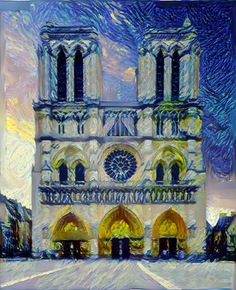
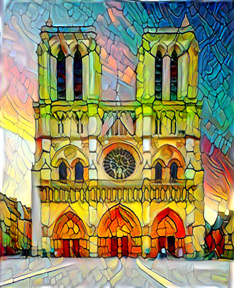
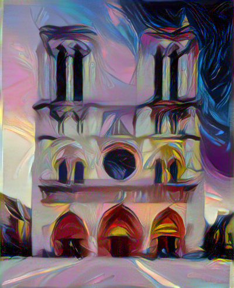

# Neural Style Transfer

<i>Final project within subject Development technologies of intelligent solutions</i>

This is a implementation of Neural Style Transfer algorithm proposed by [Gatys in 2015](https://arxiv.org/pdf/1508.06576.pdf). Method is implemented using Pytorch. Style transfer is used for images, videos and also for combining styles and transferring them to image.

The goal of this project is to apply style of one image to another image. For this procedure we consider style as colors, textures and brush strokes.

### Examples

<table>
  <tr><th>Content</th><th>Style</th><th>Target</th></tr>
  <tr height='200px'>
    <td width='400px'><image src='images/content_images/building_prague.jpg'/></td>
    <td width='400px'><image src='images/style_images/afremov.jpg'/></td>
    <td width='400px'><image src='images/building_prague_afremov.png'/></td>
  </tr>
  <tr height='200px'>
  <td align='center'><image src='images/content_images/ballerina.jpg' height='300px'/></td>
  <td align='center'><image src='images/style_images/kandinsky_1.jpg' height='200px' width='250px'/></td>
  <td align='center'><image src='images/ballerina_kandinsky.png' height='300px'/></td>
  </tr>
  <tr height='200px'>
  <td><image src='images/content_images/city_chicago.jpg'/></td>
  <td align='center'><image src='images/style_images/woman_in_colors.jpg' height='200px'/></td>
  <td><image src='images/chicago_colors.png'/></td>
  </tr>
</table>

### Combination of styles

<table>
  <tr><th>Content</th><th>Style 1</th><th>Style 2</th><th>Target</th></tr>
  <tr>
  <td><image src='images/content_images/mountain.jpg' width='350px' height='130px'></td>
  <td><image src='images/style_images/starry_night.jpg' width='350px' height='130px'/></td>
  <td><image src='images/style_images/afremov.jpg' width='350px' height='130px'/></td>
  <td><image src='images/multi_styles_mountain.png' width='350px' height='130px'/></td>
  </tr>
  <tr>
  <td><image src='images/content_images/feri.jpg' width='350px' height='130px'/></td>
  <td align='center'><image src='images/style_images/kandinsky_1.jpg' width='150px' height='130px'/></td>
  <td align='center'><image src='images/style_images/kandinsky_2.jpg' width='150px' height='130px'/></td>
  <td><image src='images/multi_styles_feri.png' width='350px' height='130px'/></td>
  </tr>
</table>
